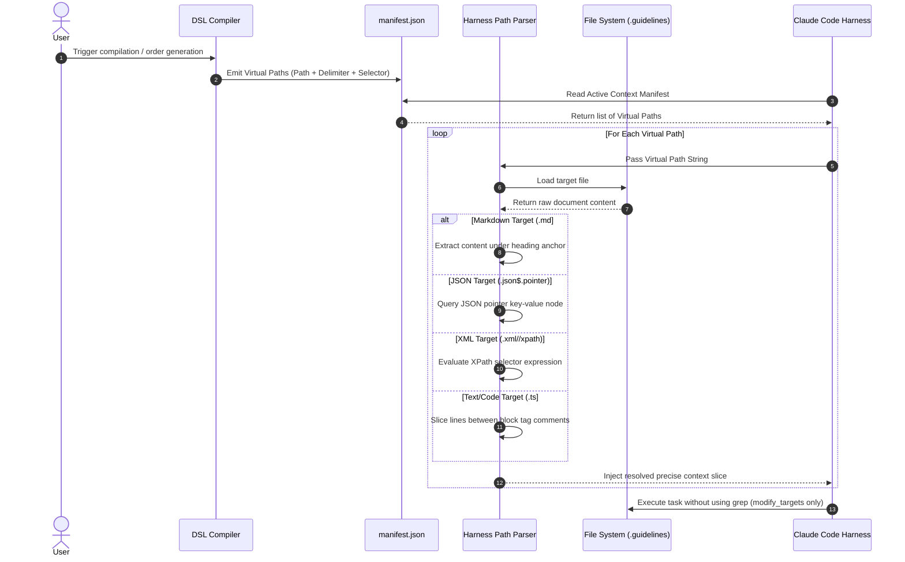

eu
>consegue ler e interpretar isso?

### Component Roles

- **Producer (DSL Compiler):** Analyzes constraints and updates `manifest.json` with deterministic Virtual Path strings.
- **Routing Interface (`manifest.json`):** Acts as the single source of truth for required context, keeping the AI away from unneeded workspace directories.
- **Resolver (Harness Path Parser):** A lightweight script or instruction layer inside Claude Code that strips raw documents down to matching anchors.
- **Consumer (Claude Code Harness):** Receives fully parsed slices directly in memory, executing target modifications without executing exploratory shell commands.

cláudio
>Sim. O diagrama é fiel ao documento: o compilador produz um `manifest.json` com strings `[caminho][delimitador][seletor]`, o parser quebra a string, o resolver escolhe a estratégia de extração pelo tipo de alvo, e o harness recebe só a fatia resolvida em memória. O ganho é substituir busca exploratória (`grep`, leitura de arquivo inteiro) por endereçamento determinístico, e o `manifest.json` funciona como fronteira de escopo: o que não está lá não entra no contexto.

O que ainda está subespecificado, na ordem em que vai doer:

**1. O `alt` do diagrama despacha pelo delimitador, e os delimitadores colidem.** `#` (heading Markdown) é prefixo de `#@` (bloco de código). Qualquer split ingênuo no primeiro `#` transforma `auth.ts#@block:jwt-validation` em heading `@block:jwt-validation`. Na prática o discriminador real é a extensão, não o delimitador. Vale inverter: casar a extensão conhecida por regex e tratar tudo depois dela como seletor opaco. Isso também resolve o `//` do XPath, que de outro modo compete com separador de diretório.

**2. `$.theme.colors` é JSONPath, não JSON Pointer.** A tabela diz "Key Selector / Pointer", o passo 3 do fluxo diz "JSON Pointer" (RFC 6901, que escreveria `/theme/colors`). São duas gramáticas diferentes com garantias diferentes: Pointer resolve para exatamente um nó, JSONPath pode resolver para zero, um ou N nós, com filtros e wildcards. Escolher Pointer dá determinismo de graça; escolher JSONPath exige a regra do item 3.

**3. Multi-match não tem regra de montagem.** XPath e JSONPath podem retornar vários nós. Sem uma regra ("ordem de documento, concatenado, separado por newline") ou uma restrição ("erro se cardinalidade ≠ 1"), a mesma virtual path pode injetar coisas diferentes conforme o arquivo cresce.

**4. O slug do heading não tem função de normalização.** `#button-accessibility` mapeia para `# Button Accessibility` por convenção implícita. Falta o algoritmo: lowercase, espaço → hífen, pontuação removida, e o que fazer com dois headings idênticos no mesmo arquivo (`-1`, `-2`?).

**5. O marcador de bloco não tem fim declarado.** O texto diz "entre o start e o end" mas o exemplo mostra só uma tag. Precisa de `@endblock:jwt-validation` explícito, regra de aninhamento (proibir é mais barato), e casamento independente do prefixo de comentário, já que "language-agnostic" implica `//`, `#`, `--` e `/* */`.

**6. Não há contrato de falha.** Heading renomeado, chave removida, tag de bloco apagada: o comportamento default de um extractor é devolver vazio. Injetar fatia vazia silenciosamente é o pior modo de falha possível, porque o harness executa a tarefa achando que leu a restrição. Isso quer dizer erro alto e, idealmente, um fingerprint (hash do slice) no manifesto para detectar deriva.

**7. `modify_targets` não tem contrato de escrita.** A última seta do diagrama assume que o harness modifica arquivos, mas o resolver é só de leitura: ele devolve texto, não o intervalo de bytes de onde o texto veio. Escrever de volta numa fatia exige o mapeamento reverso (offset inicial, offset final) que a arquitetura atual descarta.

**8. O loop recarrega o mesmo arquivo por virtual path.** `Parser->>Disk: Load target file` está dentro do `loop`. Dez seletores no mesmo `ui.md` são dez leituras. Agrupar por caminho antes de resolver é trivial e evita I/O quadrático em manifestos grandes.

**9. A fatia injetada perde proveniência.** Duas fatias de arquivos diferentes chegam ao contexto como texto solto. Prefixar cada uma com a própria virtual path dá ao consumidor como citar a origem e como distinguir restrições concorrentes.

Nada disso invalida o desenho, e os itens 1, 2, 5 e 6 são os que o harness vai ter que adivinhar a cada execução se não forem escritos. Se quiser, escrevo isso como especificação formal do resolver: gramática dos seletores em EBNF, tabela de despacho por extensão, semântica de cardinalidade e o schema do `manifest.json` com os campos de leitura e escrita separados.

eu
>ah, sim, entendo. mas estes erros são pequeninos. minha hipótese é: um sistema interno de indexador a partir do motor do Glyph e do padrão da estrutura ".guidelines/.plan", ".guidelines/.shortcuts", ".guidelines/.sources" (etc etc) -> isso ajudaria a aumentar o domínio e evitar a síntese do Harness? isso porque estou considerando que "grep" é o comando mais custoso que existe para a IA.

cláudio
>Sim, ajuda, mas não pelo motivo que você está assumindo. E vale corrigir o modelo de custo antes, porque ele muda o desenho.

**`grep` não é caro em tokens.** Um `grep` bem mirado devolve poucas linhas. O que ele cobra é round trip: cada chamada reprocessa contexto e insere um ponto de decisão onde o modelo pode derivar. Um caminho exploratório de seis buscas custa seis decisões encadeadas, e é aí que a síntese entra, porque em cada passo o modelo precisa julgar "achei o suficiente?" sem ter como saber. O índice não economiza bytes, economiza decisões. A métrica que interessa é round trips até a primeira edição correta, e ela é instrumentável: dá para medir antes e depois em vez de acreditar.

**Mas `grep` tem uma virtude que o índice não tem: ele se autocorrige.** Se o heading foi renomeado, a virtual path devolve vazio e o harness segue achando que leu a restrição. O `grep` acha o texto mesmo assim. Proibir busca exploratória remove o único mecanismo que detecta falha do índice. O desenho certo não é índice em vez de busca, é índice como caminho primário e busca como fallback auditado que emite sinal de "index miss". Sem esse sinal você troca um custo visível por um erro silencioso.

**O indexador não elimina síntese, ele a desloca para o tempo de indexação.** Alguém ainda decide que `ui.md#button-accessibility` é o pedaço relevante para a tarefa X. Isso é ganho real, mas só sob três condições: a decisão é tomada uma vez e reusada N vezes; ela fica num arquivo versionado que o Regente revisa; e ela é verificável contra a fonte por fingerprint. Se o índice for regenerado por modelo a cada sessão e nunca revisado, você pagou pela mesma síntese com passos extras e ganhou de brinde um modo de falha por cache velho.

**Domínio, no sentido que você usa, não vem de precisão. Vem de fechamento.** O harness só para de hedgear quando o manifesto pode afirmar "isto é tudo que existe de relevante". Precisão de recuperação não produz cobertura. Isso quer dizer uma invariante mecânica: todo arquivo sob `.guidelines/` aparece em pelo menos uma entrada do índice, e toda entrada resolve para conteúdo não vazio. Duas checagens baratas que transformam o manifesto em afirmação de escopo em vez de sugestão.

**O ponto crítico é o Glyph.** Você redefiniu o Glyph como ferramenta de Engenharia de Contexto com AST em JSON, e isso é exatamente o que o índice precisa. O risco é usar PGML como formato do índice em si. Se o índice está em Glyph bruto, resolvê-lo exige interpretar Glyph, e interpretação por modelo é generativa, o que reintroduz nondeterminismo na única camada que precisava ser determinística. A separação limpa é: Glyph como camada de intenção e consulta (o Regente escreve, o compilador emite), e o índice materializado em JSON ou SQLite que um parser burro resolve sem julgamento. O motor produz o índice; ele não é o índice.

**Sobre `.plan` / `.shortcuts` / `.sources`: são três tempos de vida diferentes, e só um deles merece índice.**

`.shortcuts` é pequeno, estável e usado em quase toda tarefa. Se cabe, entra pré-carregado no CLAUDE.md e não precisa de resolução nenhuma. Indexar o que sempre é lido inteiro é overhead puro.

`.plan` é mutável e escopado à tarefa, então indexá-lo é indexar churn. Também é pequeno e sempre relevante quando relevante: lê inteiro.

`.sources` é o caso real. Grande, externo, alto volume, e é onde o `grep` hoje custa mais. Aqui índice ganha, e é aqui que staleness importa mais, porque a fonte muda sem você mexer.

A conclusão estrutural é que indexação serve a uma faixa média: grande demais para pré-carregar, estruturado demais para buscar. Nomear essa faixa evita construir maquinaria para os dois extremos que não precisam dela.

**O que o índice não conserta:** o harness sintetiza quando a diretriz não existe, não quando ela não é encontrada. Se `ui.md` não diz nada sobre estado de foco, nenhuma virtual path resolve isso, e o modelo inventa igual. Pode ser que a alavanca maior no seu caso não seja o indexador, e sim uma auditoria de cobertura do `.guidelines` contra as classes de tarefa que o TEAM despacha. Isso é mensurável do mesmo jeito: registre cada vez que o harness preencheu uma lacuna e você tem a lista de diretrizes faltantes ordenada por frequência.

Se quiser, o artefato mais útil agora é o schema do índice com as invariantes de cobertura e o protocolo de index-miss, em inglês, no formato que o compilador do Glyph possa emitir como alvo. É menor que a especificação do resolver e é o que trava as garantias que você quer.

eu
>eu tava refletindo sobre isso com o Geminino (a IA Gemini, da Google, ainda é um "menino" perto de você e do próprio Gepeto) e ele concordou que o que mais ajudaria seria algo embutido no frontmatter do xml explicitando a estrutura de pastas da documentação que seria/será afetada pela edição do arquivo referenciado. exemplo: alterar A.js faz com que X.md fique defasado -> e isto está descrito no ORD que demanda alteração de A.js, bem como o caminho e uma âncora do markdown para entender de onde a leitura se torna relevante. pelo que entendi, é essa última parte que não vale a pena: não adianta delimitar seções em um arquivo que será sempre lido por inteiro. é isso que você quis dizer, ou eu deixei algo passar?

cláudio
>Você inverteu o escopo do que eu disse. A frase "não adianta delimitar seções num arquivo lido por inteiro" era sobre **quais pastas merecem índice**: `.plan` e `.shortcuts` são pequenos e quase sempre relevantes na íntegra, então ancorá-los é overhead. Não era uma afirmação geral sobre âncoras.

O seu caso é outro, e a diferença importa: **ali a âncora não é orçamento de leitura, é coordenada de escrita.**

No caminho de leitura, a âncora existe para limitar o que entra no contexto. No seu caso, `X.md#api-surface` não está dizendo "leia só isso". Está dizendo "é _isto aqui_ que ficou defasado". Mesmo que o agente leia `X.md` inteiro, a âncora continua pagando três coisas que a leitura integral não paga:

Ela delimita o escopo da edição. "X.md está desatualizado" obriga a reverificar o documento todo; "X.md#api-surface está desatualizado" é um patch. A precisão compra escopo de modificação, não de leitura.

Ela é falsificável. Uma âncora que deixou de resolver significa que o documento foi reestruturado e o vínculo quebrou. Sem âncora você não tem como detectar que o acoplamento apodreceu, só descobre quando alguém lê e estranha.

Ela dá granularidade de colisão. Duas ordens que tocam `X.md` em seções diferentes são independentes; nas mesma seção, não são. Sem âncora, tudo colide com tudo.

Então a âncora sobrevive. O que eu questionaria na proposta é outra coisa, e é mais estrutural: **o frontmatter do ORD é o dono errado dessa informação.**

O acoplamento "A.js implica X.md#api-surface" é propriedade durável do repositório. O ORD é efêmero e escopado a uma tarefa. Se a declaração mora no ORD, quatro consequências caem juntas: quem escreve o ORD precisa conhecer o grafo inteiro de acoplamento, que é justamente síntese feita pela parte menos informada; o vínculo é rederivado a cada ordem, e ordens vão discordar entre si; quando o acoplamento muda, N ordens passadas ficam silenciosamente erradas; e qualquer edição em `A.js` feita fora de um ORD não gera sinal nenhum de defasagem.

A inversão: **o documento declara suas próprias fontes, e o compilador projeta isso no ORD.** No frontmatter de `X.md`, algo como `sources: [src/A.js#@block:api-surface]`. Os docs são muito menos numerosos que os arquivos de código, já têm frontmatter, e são a coisa que apodrece, então devem ser donos da própria afirmação. O índice code→doc sai por inversão mecânica: varre o frontmatter de todo `.md`, monta o mapa reverso. Zero julgamento. O frontmatter do ORD vira _view materializada_ do índice, não fonte da verdade, e o compilador emite só o subconjunto que a tarefa toca.

E aí você ganha de graça a parte que a proposta do Gemini deixa em aberto: **detecção mecânica em vez de declarativa.** Guarde junto com a fonte o hash da fatia referenciada. Se o hash de `A.js#@block:api-surface` mudou e `X.md` não foi tocado desde então, o documento está defasado, e isso é um comando de CI, não uma lembrança de alguém. Declaração diz que _pode_ apodrecer; fingerprint diz que apodreceu.

Duas coisas em aberto, se você seguir por aí. A primeira é o custo que levantei lá atrás: se a âncora é coordenada de escrita, o resolver precisa devolver offsets, não só texto, porque escrever de volta numa fatia exige o mapeamento reverso que a arquitetura de leitura descarta. A segunda é que "defasado" não é binário. Mudança de assinatura pública obriga atualização; refactor interno talvez só mereça revisão. Sem um campo de severidade, tudo vira alerta, e alerta indiscriminado é ignorado em duas semanas.

eu
>/suba-analysis  
interessante. isso poderia ser uma ferramenta à parte... ou pode fazer parte do Glyph. eu prefiro que seja - assim, construo uma ferramenta cada vez melhor. enfim, o que você me sugere, nesse caso? eu quero que seja adicionado, não sei se faz mais sentido ao AST ou ao XML mesmo -> mas _quero que seja_ feito um sistema que implemente ".guidelines/.shortcuts/.virtual/" e defina os "caminhos virtuais" com offsets e tudo o mais para que a delimitação de escopo, detecção mecânica, granularidade de colisão e falseabilidade sejam somadas ao alcance do motor. é um investimento que dá frutos? a raiz deste problema é: _a síntese deve diminuir._

cláudio
>`/suba-analysis` — question classification first, porque ela decide o que eu posso responder.
**TOPOLOGY:** Discovery. Sem obrigação de QA estabelecida, sem dataset landed.  
**QUESTION:** "Implementar `.guidelines/.shortcuts/.virtual/` reduz a síntese do harness?"  
**QUESTION_TYPE:** causal. Afirma uma relação tratamento→efeito e pede veredito de investimento.
Roteado para o vendor de hipótese causal. O primeiro ato dele é formular H0/H1, e é aí que a coisa trava.
## STATUS: BLOCKED na pergunta como posta

Não por falta de mérito da proposta. Por três razões inferenciais:

**O desfecho não está operacionalizado.** "Síntese" não é uma variável medida no seu ambiente hoje. Não existe contador de lacunas preenchidas, nem de round trips até a primeira edição correta. Sem métrica, H1 não é falseável, e uma hipótese não falseável não se testa: ela se acredita. Isso é exatamente o oposto do que você quer construir.

**Não existe baseline pré-tratamento.** Ainda que a métrica fosse definida hoje, ela seria medida _depois_ de você já ter reestruturado o entendimento do problema ao longo desta conversa. O contrafactual está perdido.

**O confundidor dominante é você.** Construir o índice obriga a mapear o acoplamento do próprio repositório, e isso melhora o prompt do Regente independentemente de qualquer código rodar. Junte a isso troca de versão de modelo e mudança na mistura de tarefas, e um antes/depois ingênuo atribui ao `.virtual/` um efeito que pertence ao aprendizado, à versão e ao acaso.

## Onde a pergunta se resolve sem dado nenhum

O ponto útil da análise é que **as quatro propriedades que você quer somar não são o mesmo tipo de afirmação**, e só duas delas têm risco empírico.

_Falseabilidade_ e _detecção mecânica_ são **dedutivas**. Um fingerprint de fatia detecta mudança de fatia ou não detecta; uma âncora que deixou de resolver é um erro observável. São propriedades da construção, verificáveis por teste unitário, não por evidência de campo. Aqui não há ROI incerto: dado implementação correta, elas valem por definição. Não é análise que autoriza isso, é dedução, e é por isso que eu não tenho autoridade nem necessidade de opinar.

_Delimitação de escopo_ e _granularidade de colisão_ são **empíricas e condicionais**. Elas só pagam se as edições de documentação de fato se concentrarem em sub-regiões dos arquivos. Se a mediana das suas edições em `.md` toca metade do documento, a âncora não compra escopo nenhum: você reverifica o arquivo inteiro de qualquer jeito e pagou por metadado morto.

_"A síntese diminui"_ é a afirmação causal, e é a única realmente aberta.

## A parte empírica é respondível hoje, e de graça

O dataset que falta já existe: **o histórico do git**. Isso é análise descritiva, não teste de hipótese, e por isolamento metodológico eu registro como obrigação separada em vez de executar aqui misturado ao veredito causal. Três medidas, nesta ordem de consequência:

**Taxa base de defasagem.** Frequência com que um `.md` do `.guidelines` é atualizado num commit _posterior_ ao commit do código que ele descreve. Isso mede o tamanho do problema. Se for próximo de zero, todo o resto é maquinaria contra um problema inexistente e a análise para aqui.

**Localidade de edição.** Por commit que toca um `.md`, a fração de linhas do arquivo dentro dos hunks. Distribuição, não média. Isso decide se âncora compra escopo. Cauda concentrada em frações baixas favorece âncora; distribuição empurrada para 1.0 refuta.

**Acoplamento por co-mudança.** Lift de co-ocorrência dos pares (arquivo de código, arquivo de doc) nos commits. Isso entrega **o grafo code→doc derivado empiricamente**, o que dissolve a objeção que eu levantei no turno anterior sobre quem tem conhecimento para declarar o vínculo. Ninguém precisa saber: o histórico já contém, e o `sources:` do frontmatter passa a ser semeado por inversão mecânica em vez de por memória humana.

Note o que isso significa para a sequência: a medida 3 é ao mesmo tempo o diagnóstico do investimento e o bootstrap do índice. O custo de medir é quase idêntico ao custo de popular.

## Sobre AST ou XML

Fora da minha jurisdição — colocação de camada é arquitetura, roteada por manager. O que cabe dizer é uma checagem de consistência com as suas próprias definições: você fixou JSON como AST e storage entre sessões, e XML como projeção/serialização. Grafo de acoplamento e fingerprints são estado durável que sobrevive à ordem individual, logo caem no lado JSON por força da sua própria semântica; o frontmatter XML do ORD carrega a projeção do subconjunto que aquela ordem toca. Não é preferência minha, é o que as suas definições já implicam.

## Veredito limitado

Dá frutos na metade dedutiva, por construção. Na metade empírica, é desconhecido e mensurável antes de escrever código. Na afirmação causal, é hoje inverificável, e construir sem instrumentar significa que em três meses você não terá como saber se funcionou, apenas se gostou.

**ASSUMPTIONS:** repositório sob git com histórico não achatado; `.guidelines` versionado junto ao código que descreve; edições de doc feitas em commits distinguíveis das de código.

**RESIDUAL_UNCERTAINTY:** co-mudança captura acoplamento praticado, não acoplamento devido — docs que _deveriam_ ter sido atualizados e nunca foram são invisíveis à medida 3, e são precisamente o caso que o sistema existe para pegar. O grafo derivado é piso, não teto.

**TARGET_HANDOFF:** baseline descritivo → QA, para virar propriedade e oráculo mecânico do detector de defasagem. Especificação de offsets, gramática de seletor e schema do índice → DV via QA. Nenhuma das duas é minha para escrever.

Se quiser, o próximo passo que eu posso entregar dentro do meu escopo é o protocolo de medição em si, executável, com as três métricas, os limiares de decisão declarados _antes_ de rodar e a regra de parada. Declarar limiar antes é o que separa medição de justificação retroativa.